# stories_player

Fast, right-to-left-ready **stories** for Flutter: image, video, Lottie and
any-widget stories with the gestures people expect, a progress bar that never
lies, smart prefetching, and a media cache that respects the user's storage.

[](https://github.com/abdalraheemKshinba/stories_player/actions/workflows/ci.yml)
[](https://pub.dev/packages/stories_player)
[](LICENSE)

<p align="center">
  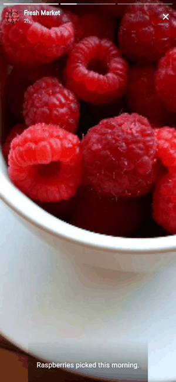
</p>

> **Live demo:** coming soon.

## See it in action

Every clip is the [example app](packages/stories_player/example). Click a
clip for the full-quality video.

<table>
<tr><td align="center" width="33%"><a href="doc/media/tap_through.mp4"></a><br><b>Tap through stories</b><br><sub>Lottie with music, a widget card, then a video</sub></td><td align="center" width="33%"><a href="doc/media/hold_to_pause.mp4">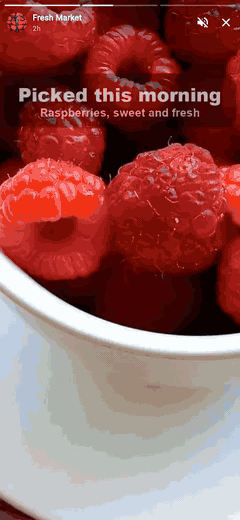</a><br><b>Hold to pause</b><br><sub>The video stops and the overlays hide until you let go</sub></td><td align="center" width="33%"><a href="doc/media/swipe_down.mp4"></a><br><b>Drag down to close</b><br><sub>The app shows behind; a short drag springs back, a fling closes, even at an angle</sub></td></tr>
<tr><td align="center" width="33%"><a href="doc/media/swipe_groups.mp4">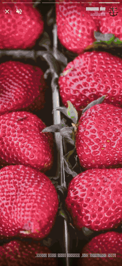</a><br><b>Swipe between groups</b><br><sub>Right to left in Arabic, like everything else</sub></td><td align="center" width="33%"><a href="doc/media/cube_transition.mp4">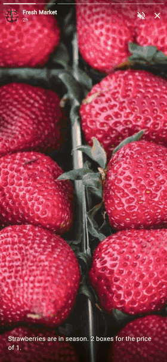</a><br><b>Cube transition</b><br><sub>Optional; the default is a light slide</sub></td><td align="center" width="33%"><a href="doc/media/order_sheet.mp4">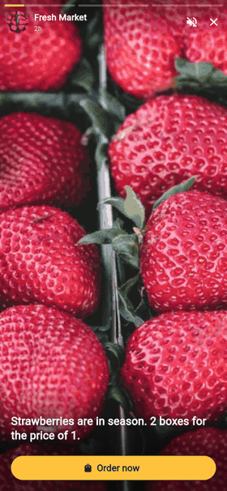</a><br><b>Call to action</b><br><sub>The story pauses while your own sheet is open</sub></td></tr>
<tr><td align="center" width="33%"><a href="doc/media/error_retry.mp4"></a><br><b>Error and retry</b><br><sub>Automatic retry, visible progress, then Skip</sub></td><td align="center" width="33%"><a href="doc/media/seen_resume.mp4">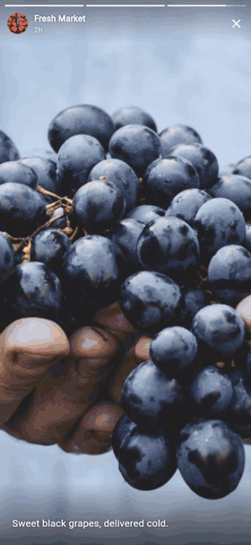</a><br><b>Resume where they left</b><br><sub>Opens at the first story not yet watched</sub></td><td align="center" width="33%"><a href="doc/media/rtl_tap_zones.mp4">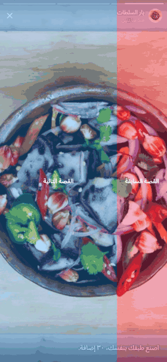</a><br><b>Right-to-left tap zones</b><br><sub>Arabic: the left side goes forward</sub></td></tr>
</table>

## Every kind of story

<table>
<tr><td align="center" width="25%">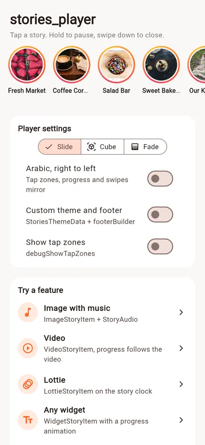<br><b>Story tray</b><br><sub>Your own tray; the player opens from any group</sub></td><td align="center" width="25%">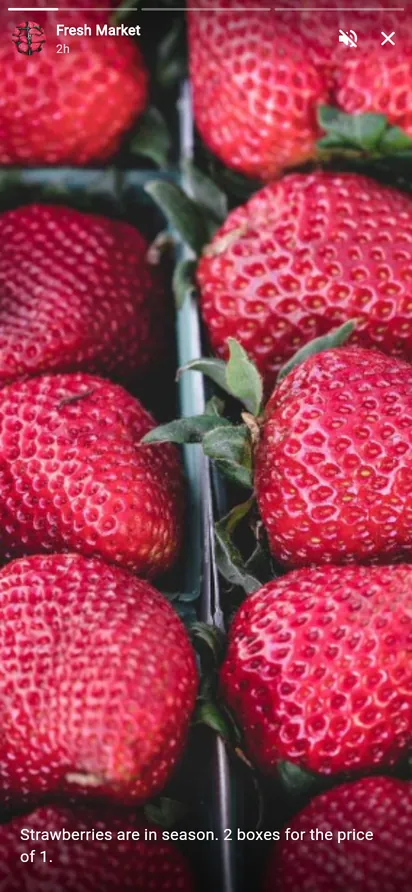<br><b>Image + music</b><br><sub>Segmented progress, caption, music that stops with its story</sub></td><td align="center" width="25%"><br><b>Video</b><br><sub>Progress follows the video, so it waits while buffering</sub></td><td align="center" width="25%"><br><b>Silent video</b><br><sub>No sound button when there is nothing to hear</sub></td></tr>
<tr><td align="center" width="25%">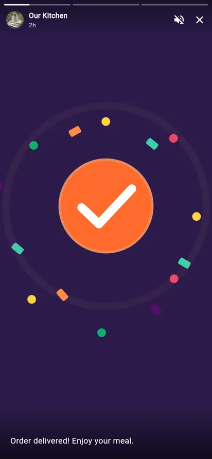<br><b>Lottie + music</b><br><sub>Parsed off the UI thread and cached</sub></td><td align="center" width="25%">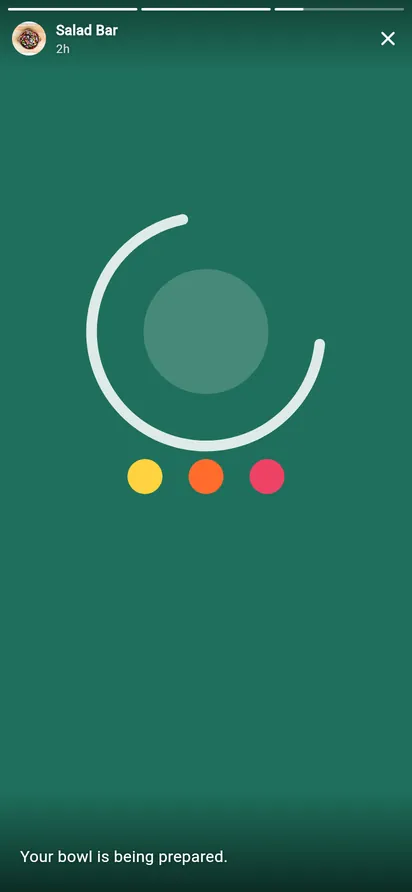<br><b>Looping Lottie</b><br><sub>Loops on the story clock</sub></td><td align="center" width="25%">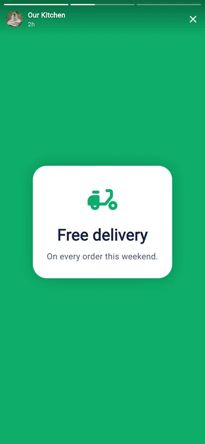<br><b>Any widget</b><br><sub>Build the story yourself; it still gets progress and gestures</sub></td><td align="center" width="25%">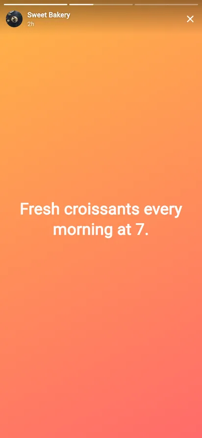<br><b>Text story</b><br><sub>A plain widget story with a gradient</sub></td></tr>
</table>

## Every case handled

<table>
<tr><td align="center" width="25%">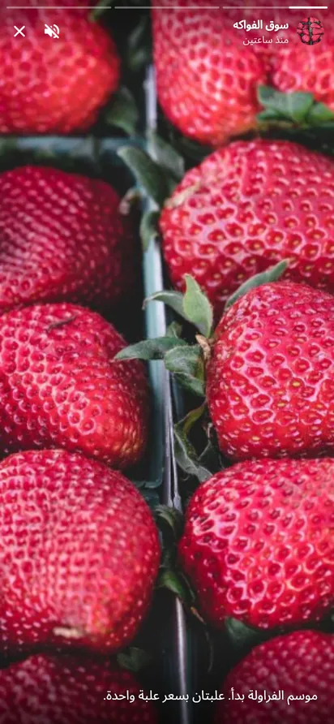<br><b>Right to left</b><br><sub>Progress, tap zones and swipes mirror; Arabic labels built in</sub></td><td align="center" width="25%">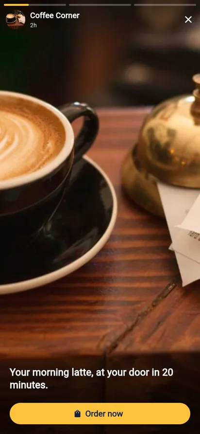<br><b>Theme + call to action</b><br><sub>StoriesTheme and your own footer</sub></td><td align="center" width="25%">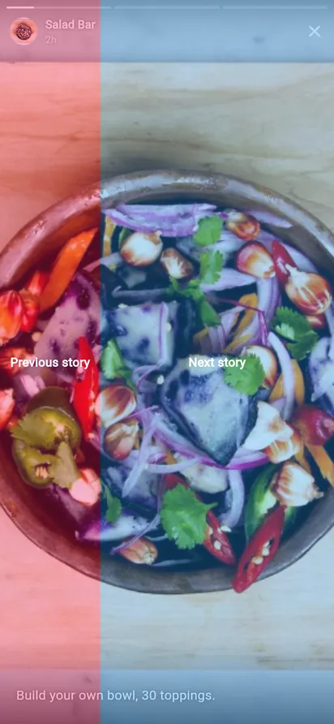<br><b>Tap zones</b><br><sub>Back on the left 30%, next on the rest</sub></td><td align="center" width="25%">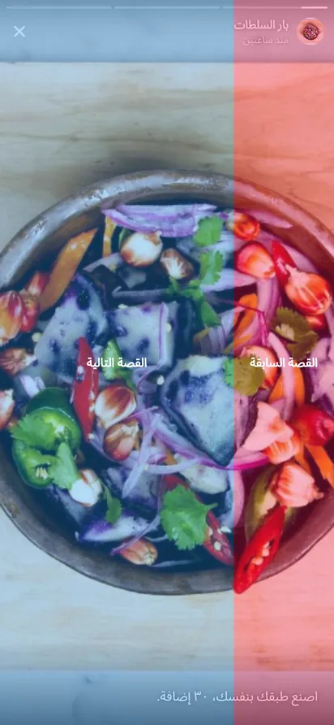<br><b>Tap zones, mirrored</b><br><sub>Next on the left in Arabic</sub></td></tr>
<tr><td align="center" width="25%">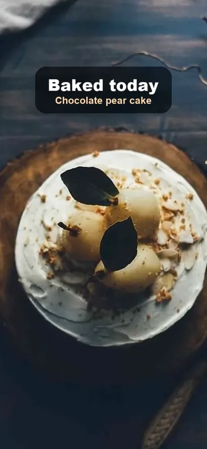<br><b>Hold to pause</b><br><sub>Overlays hide while held</sub></td><td align="center" width="25%">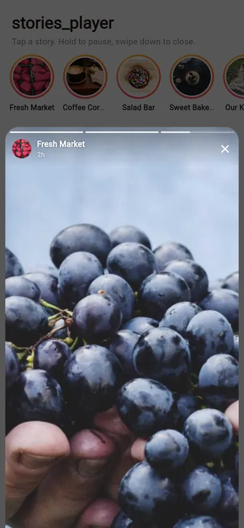<br><b>Drag down</b><br><sub>The page behind shows through</sub></td><td align="center" width="25%">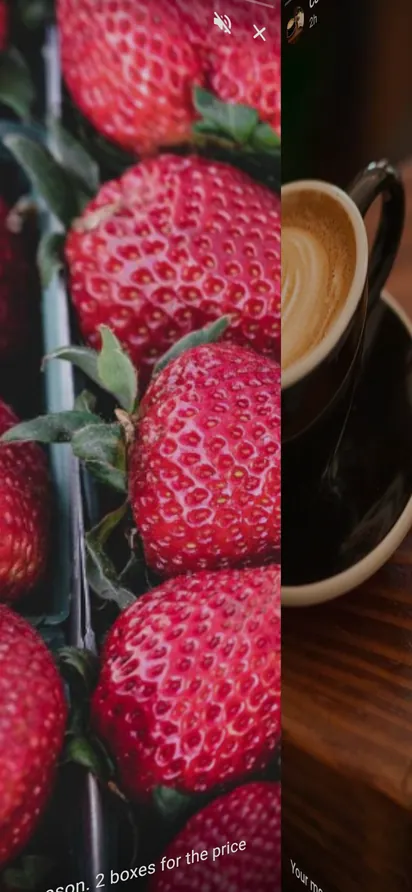<br><b>Cube swipe</b><br><sub>Between groups, following the finger</sub></td><td align="center" width="25%">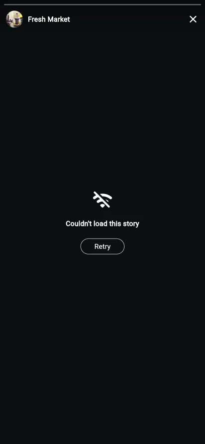<br><b>Can't load</b><br><sub>Readable over any background, with Retry</sub></td></tr>
</table>

Each behaviour is written down as a scenario in
[doc/scenarios.md](packages/stories_player/doc/scenarios.md), each tied to the
test that proves it.

## Quick start

```yaml
dependencies:
  stories_player: ^0.1.0
  stories_player_video: ^0.1.0   # only if you show videos
  stories_player_lottie: ^0.1.0  # only if you show Lottie
  stories_player_audio: ^0.1.0   # only if you play music
```

```dart
import 'package:stories_player/stories_player.dart';

final groups = [
  StoryGroup(
    id: 'market',
    label: 'Fresh Market',
    avatar: StoryMedia.network(Uri.parse('https://cdn.example.com/market.webp')),
    items: [
      ImageStoryItem(
        id: 'strawberries',
        image: StoryMedia.network(Uri.parse('https://cdn.example.com/s1.webp')),
        caption: 'Strawberries are in season.',
      ),
    ],
  ),
];

Navigator.of(context).push(
  MaterialPageRoute<void>(builder: (_) => StoriesPlayer(groups: groups)),
);
```

That is a complete player: progress bar, header, caption, gestures, caching
and prefetching included. The [stories_player README](packages/stories_player/README.md)
covers a real setup, controlling the player, caching, customizing and
performance on small phones.

## Packages

| package | what it adds | pub.dev |
|---|---|---|
| [`stories_player`](packages/stories_player) | the player, image and widget items, cache, prefetch, theme | [](https://pub.dev/packages/stories_player) |
| [`stories_player_video`](packages/stories_player_video) | video items, over `video_player` | [](https://pub.dev/packages/stories_player_video) |
| [`stories_player_lottie`](packages/stories_player_lottie) | Lottie items, over `lottie` | [](https://pub.dev/packages/stories_player_lottie) |
| [`stories_player_audio`](packages/stories_player_audio) | music behind stories, over `audioplayers` | [](https://pub.dev/packages/stories_player_audio) |

Add only what you use: the core depends on nothing heavy.

## Repository

```
packages/
  stories_player/          the core package, its tests, and the example app
  stories_player_video/
  stories_player_lottie/
  stories_player_audio/
doc/media/                 the clips in the READMEs (GIF and MP4)
```

See [CONTRIBUTING.md](CONTRIBUTING.md) to build, test and release.

## License

BSD 3-Clause. See [LICENSE](LICENSE). Made by [Abdulraheem Kshinba](https://github.com/abdalraheemKshinba).
