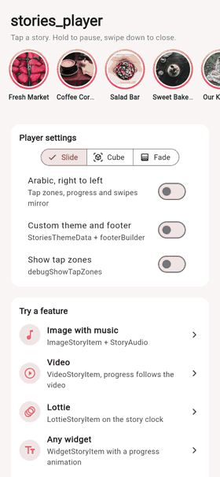
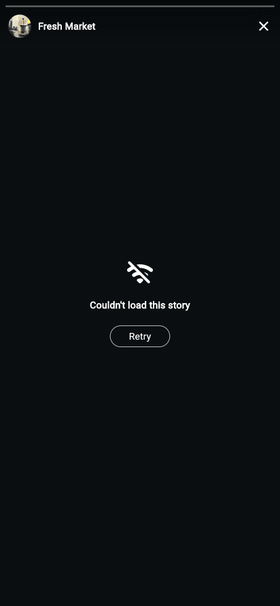

# stories_player

Fast, right-to-left-ready **stories** for Flutter — image, video, Lottie and
any-widget stories with the gestures people expect, a progress bar that never
lies, smart prefetching, and a media cache that respects the user's storage.

<p align="center">
  <a href="doc/media/tap_through.mp4"></a>
  <a href="doc/media/swipe_down.mp4"></a>
  <a href="doc/media/error_retry.mp4"></a>
</p>

> **Live demo:** coming soon.

## Packages

| package | what it adds | pub.dev |
|---|---|---|
| [`stories_player`](packages/stories_player) | the player, image and widget items, cache, prefetch, theme | [](https://pub.dev/packages/stories_player) |
| [`stories_player_video`](packages/stories_player_video) | video items, over `video_player` | [](https://pub.dev/packages/stories_player_video) |
| [`stories_player_lottie`](packages/stories_player_lottie) | Lottie items, over `lottie` | [](https://pub.dev/packages/stories_player_lottie) |
| [`stories_player_audio`](packages/stories_player_audio) | music behind stories, over `audioplayers` | [](https://pub.dev/packages/stories_player_audio) |

Add only what you use: the core depends on nothing heavy.

Start with the [stories_player README](packages/stories_player/README.md):
quick start, every feature in action, customizing, and performance notes.
Every behaviour is written down as a scenario in
[doc/scenarios.md](packages/stories_player/doc/scenarios.md), each tied to the
test that proves it.

## Repository

```
packages/
  stories_player/          the core package, its tests, and the example app
  stories_player_video/
  stories_player_lottie/
  stories_player_audio/
doc/media/                 the clips in the READMEs (GIF and MP4)
```

See [CONTRIBUTING.md](CONTRIBUTING.md) to build, test and release.

## License

BSD 3-Clause. See [LICENSE](LICENSE). Made by [Abdulraheem Kshinba](https://github.com/abdalraheemKshinba).
